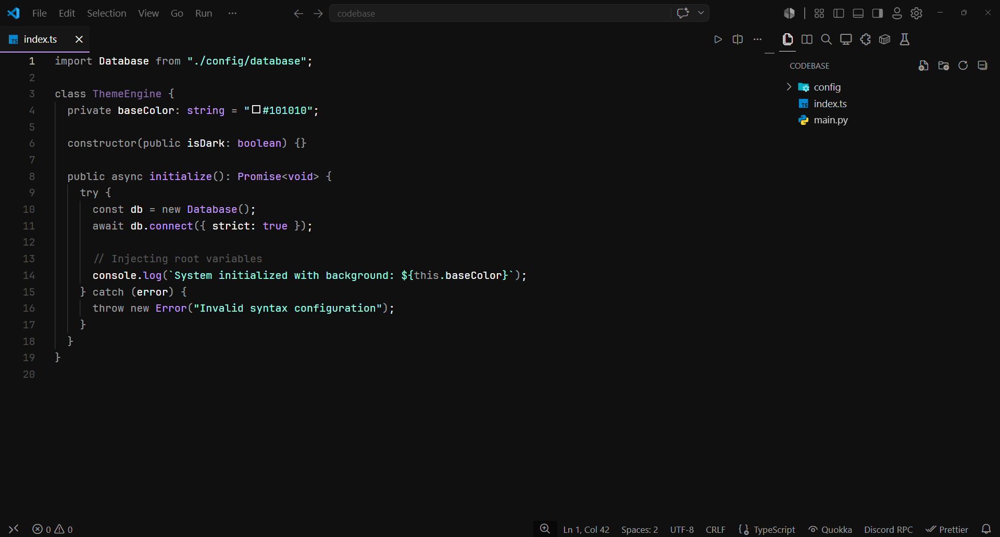

  

# PITCH BLACK

---

Pitch Black is a refined dark theme for Visual Studio Code designed for focus and readability. It features a unified `#101010` background to reduce eye strain, paired with a carefully balanced color palette that makes code syntax easy to scan without unnecessary visual clutter.

---

## Features

- **Unified Interface:** A consistent `#101010` background across the editor, terminal, activity bar, and sidebars.
- **Subtle UI Accents:** Active tabs and elements are highlighted in a soft Lilac (`#C699FF`), while inactive elements blend naturally into the background.
- **Clean Syntax Highlighting:**
  - **White (`#FFFFFF`):** Variables and plain text.
  - **Lilac (`#C699FF`):** Functions, classes, HTML tags, and JSON keys.
  - **Cyan (`#99FFE4`):** Strings, inherited classes, and symbols.
  - **Slate (`#A0A0A0`):** Keywords, operators, and punctuation.
  - **Magenta (`#E580FF`):** Errors, invalid syntax, and deleted code.
  - **Muted Gray (`#8B8B8B`):** Comments.

## Installation

### Via Marketplace

1. Open the Extensions sidebar in VS Code (`Ctrl+Shift+X` / `Cmd+Shift+X`).
2. Search for **Pitch Black**.
3. Click **Install**.
4. Open the Command Palette (`Ctrl+K Ctrl+T` / `Cmd+K Cmd+T`) and select **Pitch Black**.

### Manual Installation

1. Download the latest `.vsix` package from the repository's Releases section.
2. Drag and drop the `.vsix` file into the Extensions sidebar in VS Code.
3. Select **Pitch Black** in your Color Theme settings.

---

## Author & Links

**Yash Vardhan**

- **Portfolio:** [yash-pluto.vercel.app](https://yash-pluto.vercel.app/)
- **GitHub:** [@yash-pluto](https://github.com/yash-pluto)
- **LinkedIn:** [Yash Vardhan](https://linkedin.com/in/vardhan-yash3105)
