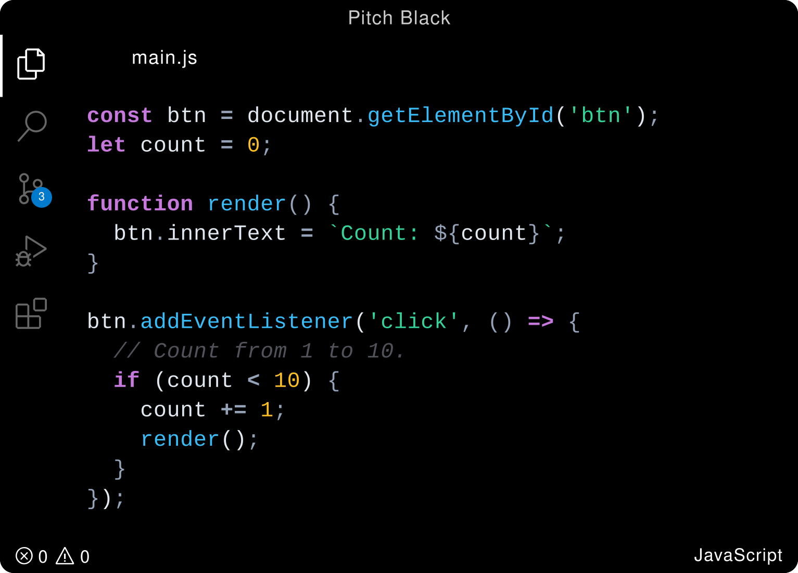
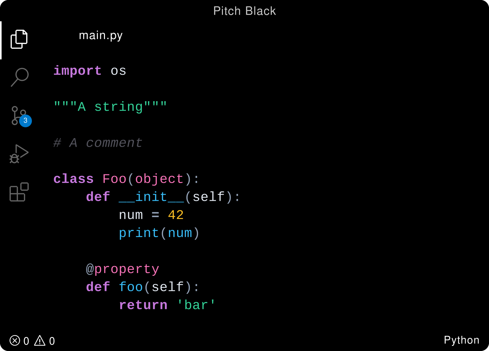

# 🌑 Pitch Black Modern

**A zero-distraction, true pitch-black theme for Visual Studio Code.**

---

Designed for developers who demand absolute high contrast and deep blacks. **Pitch Black Modern** eliminates UI clutter, blending the tab bar, sidebars, and editor into a seamless `#000000` canvas while keeping your code crisp and highly legible.

Heavily optimized for modern web development, this theme ensures beautiful syntax highlighting whether you are working with standard HTML/CSS or building complex interfaces with React and Next.js. Perfect for OLED displays and late-night, zero-distraction coding sessions.

## 🖼️ Preview

  
  

## ✨ Features

- **True Black Canvas:** Absolute `#000000` across the editor, terminal, activity bars, and panels.
- **Seamless UI:** Tabs, breadcrumbs, and editor borders are completely blacked out for a unified, distraction-free environment.
- **Modern High-Contrast Syntax:**
  - 🧊 **Standard Text:** Crisp slate for superb readability.
  - 💧 **Functions & CSS:** Vibrant sky blue (`#38BDF8`) for functions, methods, and properties.
  - 🍂 **Strings & Values:** Warm orange-brown (`#CE9178`) for beautiful, complementary contrast.
  - 📐 **HTML/JSX Structure:** Classic dark blue tags (`#569CD6`) and crisp cyan attributes (`#9CDCFE`) for instant structural scannability.
  - ⚡ **Control Flow:** Subtle magenta for keywords and control statements.

## 🚀 Installation

### Via VS Code Marketplace (Recommended)

1. Open the **Extensions** sidebar in VS Code (`Ctrl+Shift+X` / `Cmd+Shift+X`).
2. Search for **"Pitch Black Modern by Yash-Pluto"**.
3. Click **Install**.
4. Open the Command Palette (`Ctrl+K Ctrl+T` / `Cmd+K Cmd+T`), search for **Color Theme**, and select **Pitch Black Modern**.

### Manual Installation

1. Download the latest `.vsix` package from the [Releases](#) section.
2. Open VS Code and drag-and-drop the `.vsix` file into the Extensions sidebar.
3. Select **Pitch Black Modern** from your Color Theme settings.

Enjoy the darkness! 💻

---

## 👨‍💻 Author & Support

Built with focus by **Yash Vardhan**.

🌐 **Portfolio:** [yash-pluto.vercel.app](https://yash-pluto.vercel.app/)  
🐙 **GitHub:** [@yash-pluto](https://github.com/yash-pluto)  
💼 **LinkedIn:** [Yash Vardhan](https://linkedin.com/in/vardhan-yash3105)

_If you enjoy the darkness, consider leaving a ⭐ on the repository or a review on the VS Code Marketplace!_
