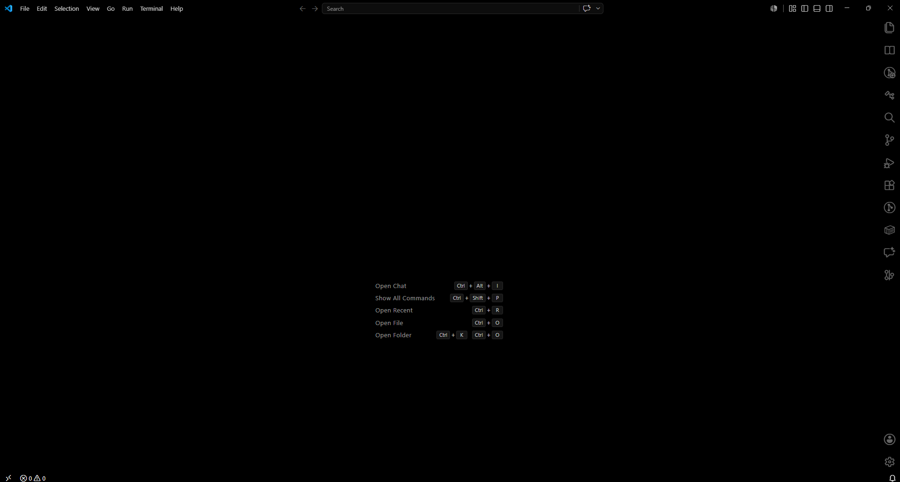
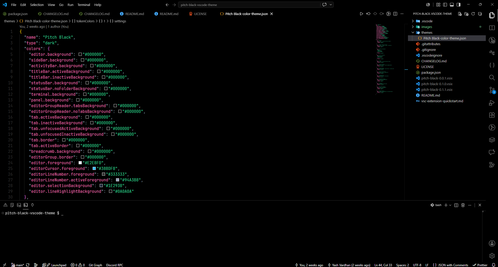

# Pitch Black Modern 🌑  

A zero-distraction, true pitch-black theme for Visual Studio Code.

Designed for developers who love absolute high contrast and deep blacks. This theme eliminates UI clutter, blending the tab bar, sidebars, and editor into a seamless pitch-black canvas while keeping your code crisp and highly legible. It is heavily optimized for modern web development, ensuring beautiful syntax highlighting whether you are working with standard HTML/CSS or building complex interfaces with React and Next.js. Perfect for OLED displays and late-night coding sessions.

## 🖼️ Preview

## ✨ Features

- **True Black Canvas:** Absolute `#000000` across the editor, terminal, and activity bars.
- **Seamless UI:** Tabs, breadcrumbs, and borders are completely blacked out for a distraction-free environment.
- **Modern High-Contrast Syntax:**
  - Crisp slate text for standard variables.
  - Neon amethyst for keywords and control statements.
  - Vibrant sky blue for functions, methods, and CSS properties.
  - Emerald greens and amber yellows for strings and numbers.
  - **NEW:** Coral tags and italicized amber attributes for perfect HTML/JSX readability.

## 🚀 Installation

### Via VS Code Marketplace (Recommended)

1. Open **Extensions** in VS Code (`Ctrl+Shift+X`)
2. Search **"Pitch Black Modern by Yash-Pluto"**
3. Click **Install**
4. Go to **Settings > Color Theme** (`Ctrl+K Ctrl+T`) and select **Pitch Black Modern**

### Manual Install

1. Download the latest `.vsix` from the **Releases** section
2. Drag and drop into the Extensions sidebar
3. Select **Pitch Black Modern** from Color Theme settings

Enjoy the darkness! 💻

---

## 👨‍💻 Author

Built by **Yash Vardhan**.

- **Portfolio:** [yash-pluto.vercel.app](https://yash-pluto.vercel.app/)
- **GitHub:** [@yash-pluto](https://github.com/yash-pluto)
- **LinkedIn:** [Yash Vardhan](https://linkedin.com/in/vardhan-yash3105)
